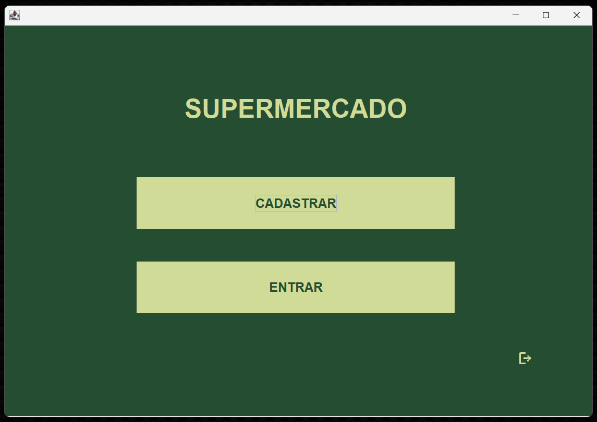
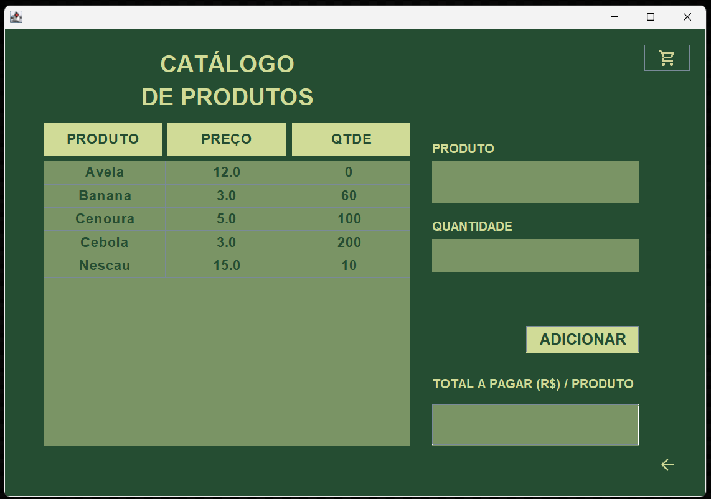
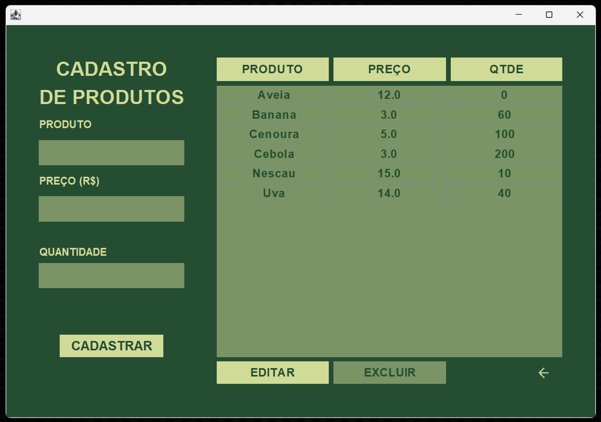
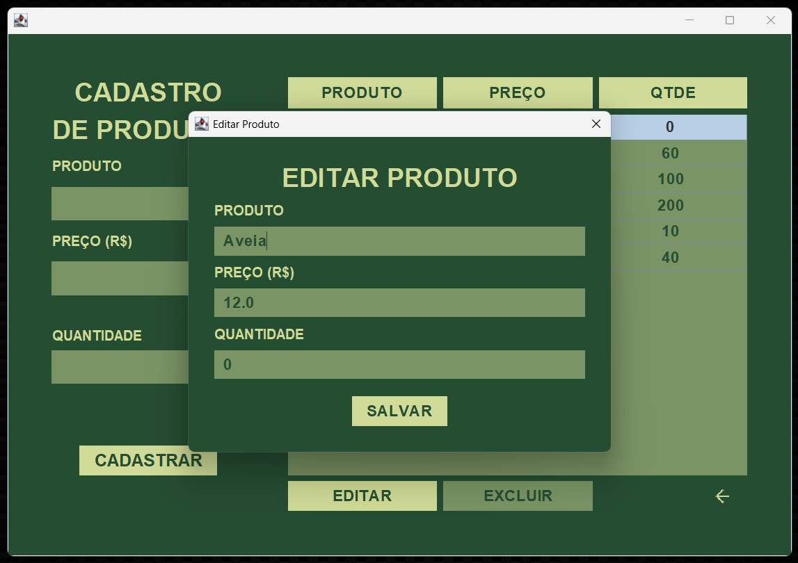
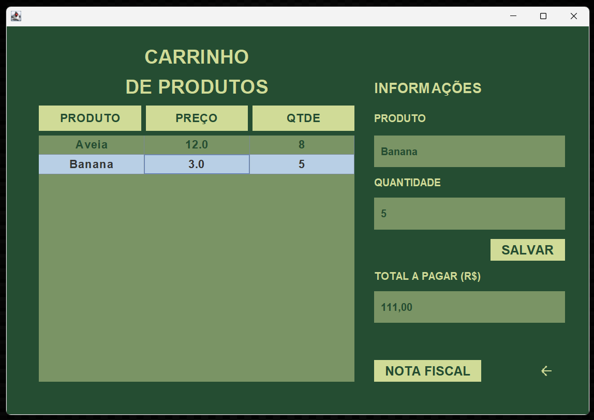
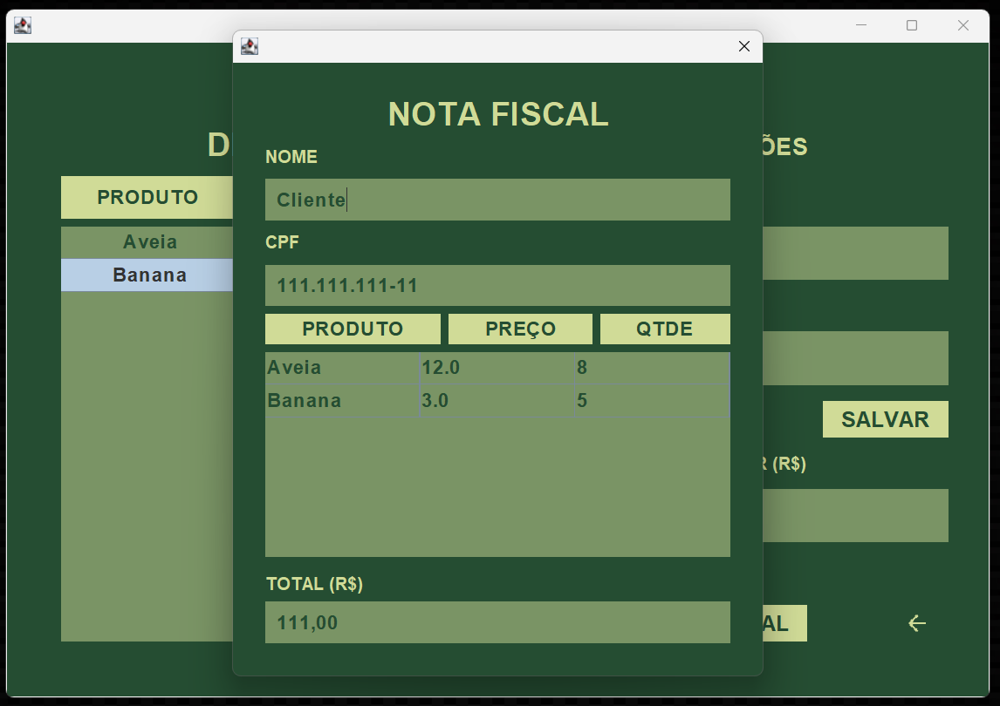

# Sistema de Supermercado em Java

## Sobre o Projeto

Projeto desenvolvido durante a disciplina de Projeto e Desenvolvimento de Sistemas do Técnico Integrado em Informática (IFSC).

O sistema simula um ambiente de supermercado, permitindo o gerenciamento de produtos, clientes e vendas.
Desenvolvido em Java, utilizando Programação Orientada a Objetos (POO) e arquitetura MVC (Model-View-Controller).  
Interface gráfica construída com Java Swing, utilizando MigLayout para organização dos componentes, além de integração com banco de dados SQL.

---

## Funcionalidades

- Cadastro de produtos  
- Edição e remoção de produtos  
- Controle de estoque  
- Cadastro de clientes  
- Sistema de vendas/pedidos  
- Login de usuários e administradores
- Persistência de dados em banco SQL  

---

## Tecnologias Utilizadas

- Java (POO)  
- Java Swing (GUI)  
- MigLayout (layout manager)  
- SQL (Banco de dados relacional)  
- Arquitetura MVC  

---

## Arquitetura MVC

O projeto segue o padrão MVC, dividido em:

- Model: Responsável pelas entidades e regras de negócio (Produto, Cliente, Venda etc.)
- View: Telas do sistema desenvolvidas com Java Swing
- Controller: Intermedia a comunicação entre Model e View

---

## Banco de Dados

O sistema utiliza um banco de dados SQL para persistência dos dados.

Tabelas principais:

- usuarios  
- produtos  
- carrinho  

---

## Interface do Sistema

### Tela Inicial

### Catálogo

### Cadastro de Produtos

### Edição de Produtos

### Carrinho

### Emissão de Nota Fiscal

---

## Observação

Este projeto tem fins acadêmicos e foi desenvolvido com foco em aprendizado de:

- POO
- MVC
- Desenvolvimento de aplicações desktop
- Integração com banco de dados
- Interface gráfica com Java Swing e MigLayout
